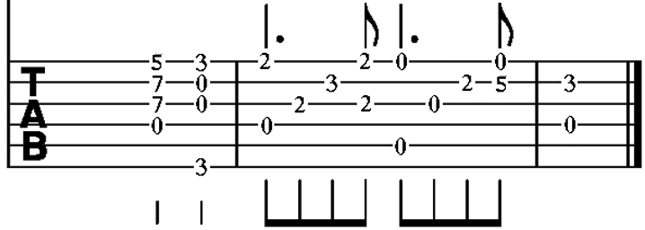

# CSE 493 Final Project Handin: Talking Guitar Tabs

**Names: Cara Lisy and Jasmine Herri**

## Introduction (in plain language) 

### What Are Guitar Tabs?

Musicians often read sheet music to tell them how to play a song. There are many different kinds of sheet music. The most common kind is called "modern staff notation". This type of sheet music has 5 horizontal lines that tell musicians what pitch a note should be. "Pitch" is how high or low a note is.

Different notes have different durations. Musicians know how long a note is based on the symbol used for the note. They read the sheet music from left to right.

Below is an example of modern staff notation for the piano:


*By en:User:Prof.rick - author's "own edition and arrangement", Public Domain, https://commons.wikimedia.org/w/index.php?curid=5222815*

But, some songs are not written in modern staff notation. Guitar songs are often written as "guitar tabs". Guitar tabs are a different kind of sheet music. They have six horizontal lines, not 5. There is one line for each string on the guitar.

A number on a line tells the musician what "fret" they should play. Guitar players push down on the strings in different places to make different notes. The location they push down on is called a "fret".

Note symbols above and below the numbers tell musicians how long to play each note. They are very similar to the symbols used in modern staff notation. Guitar tabs are read from left to right, just like modern staff notation.

Below is an example of a guitar tab:



*By Bitethesilverbullet - Own work, CC BY-SA 4.0, https://commons.wikimedia.org/w/index.php?curid=68432164*

### The problem we are solving

Musicians have to be able to see clearly to read guitar tabs. So, people who are blind or low vision might not be able to read them easily. 
Sometimes, they may listen to a song and try to play what they hear. But, this can be hard to do for many people, whether they can read guitar tabs or not.
It usually takes lots of practice to be good at playing what you hear. Guitar tabs tell musicians exactly what they should play.
Our project is an accessible format for guitar tabs: A Talking Score.

A Talking Score has the same information as sheet music, but the information is written with words rather than symbols. People can use screen readers to read the Talking Score out loud.
This way, they can learn the information in the sheet music. They do not need to be able to see it.

Talking Scores already exist for modern staff notation.
They tell users note names and lengths so that they can have all of the information from the sheet music. Visit the [Talking Scores Project](https://www.talkingscores.org/) to learn more.

However, we could not find Talking Scores for guitar tabs. A guitar tab Talking Score should tell people the string number and fret number for a note, not the name of the note. We built our project to solve this problem.

### Why it is important to solve this problem

Some musicians may be unable to see sheet music, but you do not need to be able to see to play an instrument. All musicians should have access to sheet music in some way.
Talking Scores are an accessible format for sheet music. With Talking Guitar Tabs, guitarists can access the type of sheet music made for their instrument, even if they can't see well.

Music is very important to many people. It can help people relax and feel better. It is also a way to make friends by playing in groups. Blind and low vision people deserve
access to these benefits of playing music just as much as sighted people do. They should be able to access the information in sheet music on their own.

By making an accessible website where they can convert sheet music to a Talking Guitar Tab, blind and low-vision people can perform this task themselves. They can download a musicXML file from a website like [MuseScore](https://musescore.org/en). Or, they can make a guitar tab in a sheet music editor and convert it to musicXML there. Then, they just need to upload it into the Talking Guitar Tabs website.

Our goal is to make music more accessible to everyone. We hope that this project can help more guitarists access useful guitar tabs.

## Positive Disability Principals

### Ableist
This technology is not ableist. It is tailored specifically for people with low vision, reading, or cognitive processing disabilities that results in it being difficult to read guitar tabs. This project tackles the visual barrier of guitar tabs and converts them into an textual and potentially auditory form when read with a screen reader. While this product does not only have to be used by people with disabilities, it is not discriminatory against disabled individuals. It can be used by anyone who either needs or prefers non-visual musical representation whether they are disabled or not. This includes people who are visually impaired or people who are auditory learners. This product is also not a disability dongle because both of our first person accounts explained the difficulties of reading existing sheet music. Our project is also based off of the original Talking Scores project, which was designed and built by people who are blind or have low vision. Therefore, the Talking Guitar Tabs web application is a reasonable solution for a real problem in the disabled community. 

### Accessible in part or as a whole
This product is accessible as a whole. It translates visual guitar tabs into a textual and auditory form. It does not require a significant amount of user action. This translation includes imperative information in the original sheet music including key, time signature, and tempo in each measure. The Talking Guitar Tabs web application also provides users with the option of showing this information for every measure or not. Therefore, not only are the guitar tabs more accessible in the app, but users are given autonomy in how they want to use it, giving them more control on how they process the music being interpreted. This app also addresses a variety of disabilities ranging from low vision/blindness to dyslexia and cognitive-processing disorders. Thus, this app reaches many different groups within the disability community, contributing to its accessibilty as a whole. 

It is worth noting that there is still opportunity for improving the translation by including accidentals, articulation, and more in the original sheet music to reach full 1:1 parity, but we have chosen the elements we deemed most crucial to interpreting the music to implement given the time frame. More parity would yield better accessibility of the original guitar tab source material.

### Disability led
This product is not disability led. Neither of the group members possess the visual or cognitive disabilities that could benefit from this product. However, as previously mentioned, this product is not limited to use by disabled individuals only. It can also be used by people who simply prefer auditory instruction over visual cues. Moreover, we based this product on multiple first-person accounts by people with disabilities as described in our proposal. These first-person accounts detailed the difficulties of visual music reading from their personal experience, supporting the development of this product.

### Being used to give control and improve agency for people with disabilities
This product definitely gives controls and improves agency for people with disabilities. It allows individuals to choose what method they want to learn music in. Even within this app, with the textual representation of the music, users can both magnify the text for interpretation or use a screen reader to read the information aloud. This, this web app frees users from the limitations of textual sheet music in multiple ways. Also, in the Concert Band and Low Vision first person account, the writer talked about how “a school paraprofessional would resize my music on larger paper and print it horizontally, and my directors would work with me to ensure no notes or important symbols were cut off.” This tool with remove the dependence on other people to provide accessible music, improving agency for people with disabilities. In addition, as previously mentioned, the Talking Guitar Tabs web application also provides users with the option of showing the key, time signature, and tempo for every measure or not. Therefore, users are given autonomy in how they want to use the app, giving them more control on how they process the music they want to interpret.

### Addressing the whole community
This product does not address the whole community because it is specifically tailored towards individuals with visual or cognitive disabilities. This product would not be effective for those with hearing impairments since the output either textual but in a different format than before or auditory with a screen reader. It also does not directly address nor exclude those with mobility issues. Even though the product is not aimed to be incredibly complex to use, the goal was not to improve mobility concerns for musicians.

## Methodology and Results: 

### What we designed and implemented
We designed a Flask application that takes in a .musicXML file and then parses it into a text format that can be read by a screen reader. The output of the file parser looks like this:

```
h1: Title
    h2: Song summary
        Composer
        # of measures 
    h2: Formatting options 
        Toggle: show time, key, and tempo every measure
    h2: Measures
        h3: Measure 1
            Time signature
            Key 
            Tempo 
            - <note duration>, <string #, fret #>, <string #, fret #>
            - <note duration>, <string #, fret #>
        h3: Measure 2
            Etc. 
```           

Specifically, we extracted the time signature, key, and tempo for each measure. We also extracted the notes and chords of the measure. We then placed this information into a customized dictionary as the output of our parser. 

On the Flask side, we have a home page template and a guitar_tab_template. The home page accept the .musicXML file through a form submission and the guitar_tab_template shows the parsed results. 

One of the key things we implemented was the toggle under Fomratting Options that controls whether the user sees the the time, key, and tempo every measure. This toggle is automatically set to true when the page laods. When it is set to false, then the time, key, and tempo are only displayed if they change. For example, if the tempo is different in Measure 3 than in Measure 2 then the tempo will be dislayed in Measure 3. Since the time sigature and the key didn't change, they are not displayed in Measure 3. 

Here is an example output of our web application. 


## Disability Model Analysis

### Recognizing Wholeness

#### Defintion 
The principle of Recognizing Wholeness acknowledges that every individual is a culmination of past and present experiences. These experiences include their thoughts, emotions, and fantasties. Every person is a whole person, whether they are disabled or not. 

#### Analysis
Music is an inherently personal thing. Many musicians play to evoke the audience's emotions by communicating their experiences through song. The Talking Guitar Tabs web application recognizes wholeness by increasing accessibility to guitar tabs. This project provides another way for guitarists with disabilities--whether they be visual or mobile or otherwise--to perceive the typically visual notes as written, allowing them to interpret music in way that aligs with their own experiences and emotions.

### Intersectionality

#### Defintion 
This principle of Intersectionality refers to the cross-over between a person's discriminatory and non-discriminatory experiences. This overlap can both compound or improve unjust experiences, showing that a person is a culmination of multiple areas of life. Theese areas include the overlap between sexism and racism, ableism and homophobia, etc. 

#### Analysis
Music is a key component of many cultures and religions. Thus, music is an imperative portion of an individual identity in addition to disability. Tabs are one way that these songs can be represented, so increasing accessibility to these tabs can make sharing these cultural perspectives more accessible for blind or low vision musicians who may wish to share music that is part of their identity. Moreover, when it comes to the crossover of different disabilities, someone with both mobile and visual disabilties may struggle with visual guitar tabs. Therefore, the Talking Guitar tabs web application can address this challenging experience by providing an additional method of musical interpretation. 

### Anti-capitalist Politics

#### Defintion 
The Anti-capitalist Politics principle refers to the rejection of a system that prioritizes those who are able-bodied, of the racial majority (typically White), and are gender normative. The rejetion of this system discourages competing for survival and encourages all contributions from all sorts of people.

#### Analysis
While this project (and music itself) is not inherently political, it has the power to both embody and fail to embody this principle depending on how it’s employed. Music can be a leisurely activity, giving listeners a break to feel their emotions or connect with others' emotions. By increasing accessibility for sheet music, we can increase accessibility to making music and the leisurely experience of listening to it. However, music is often also a means to profit. To embody this principle, accessible sheet music formats cannot be a reason to make more monetizable music, but rather more music for enjoyment. Thus, this project does not encourage montetary advancement or competing for survivial but rather emphasizes additional modes of musical access.


## Learnings and future work:

### What we learned

We faced many challenges when designing and implementing our Talking Guitar Tabs project. Most of our struggles came from the variety of formatting within exported musicXML files. Despite it being a standardized format, there are a variety of ways to notate the same thing and the music21 library we extended for parsing did not always cover all edge cases. Often, the exported musicXML is only as easy-to-parse as the original guitar tabs are well-written. Poorly- or unconventionally-notated sheet music can limit accessibility because it creates hard-to-interpret musicXML. Composers and transcribers of guitar tabs can make their scores more accessible to other programs such as our project by using simpler notation.

### Future applications and extensions

There are a variety of features that could be added to our project to make it more robust and convey more of the information found in guitar tabs and increase accessibility. There is a variety of musical notation that is important to support in future works to increase parity with written notationi. This includes structural elements like repeats, note and rhythm details like ties and articulations, and guitar specific notation like hammer-ons and pull-offs.

Additionally, there are some features that the original Talking Scores project has that blind and low-vision individuals have said are beneficial to them. This includes the ability to play the midi representation of selected measures so users can listen to the score that the text represents.

We hope to see continued improvement in accessibility for music scores so that everyone can enjoy playing music.